# WEAR SHEARE

## 📄 기획 배경 

🐷 웨어쉐어는 의류 판매 및 렌탈(대여) 서비스를 제공하는 의류셰어링 플랫폼입니다.
렌탈(대여)서비스를 제공하면 다양한 옷들을 입고 싶거나 특별한 날에 일회성으로 필요한 고객의 니즈를 충족시켜 줄 수 있습니다.

<br>

## 📄 기술 스택

```
JSP, Ajax, MySQL
```

<br>

## 🖥️ 실행 화면

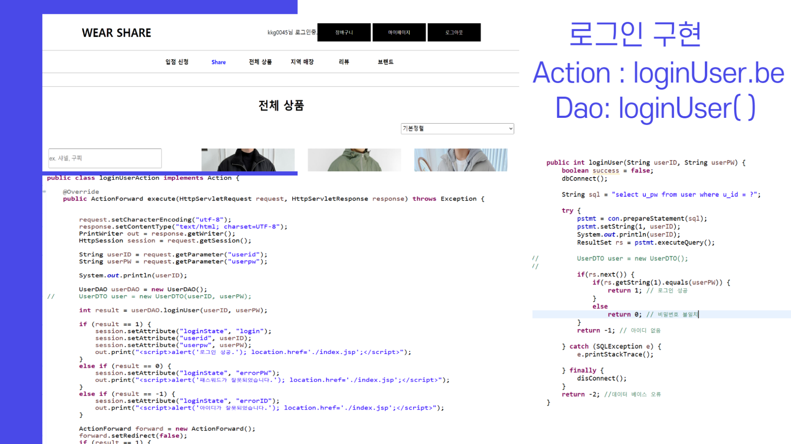<br>
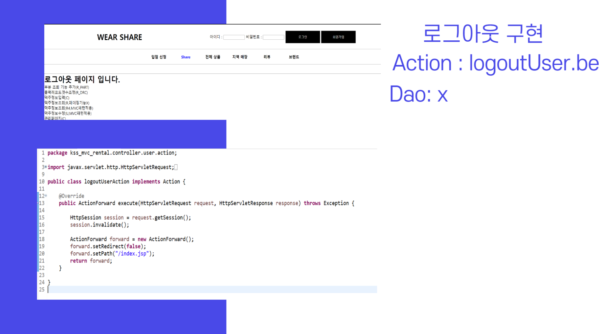<br>
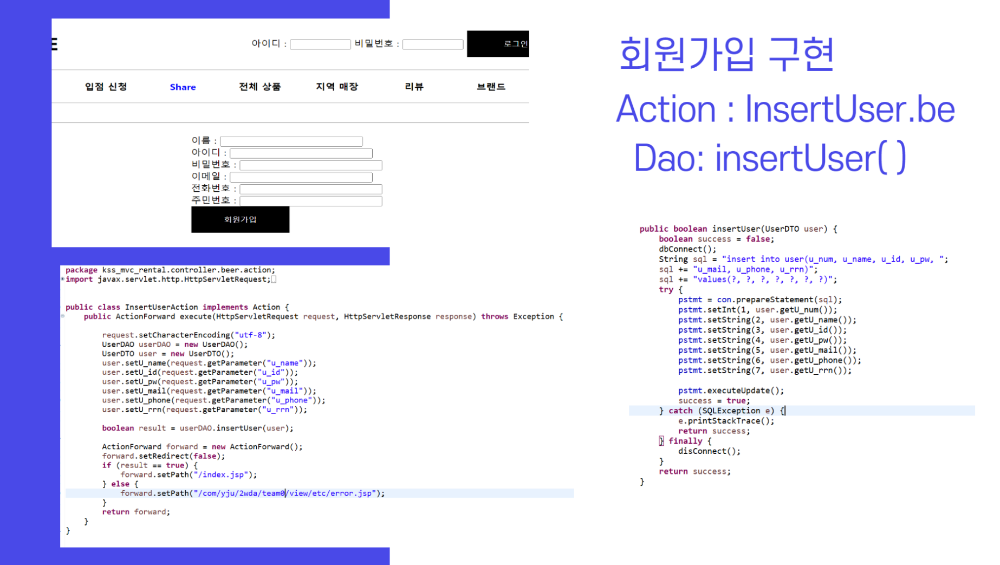<br>
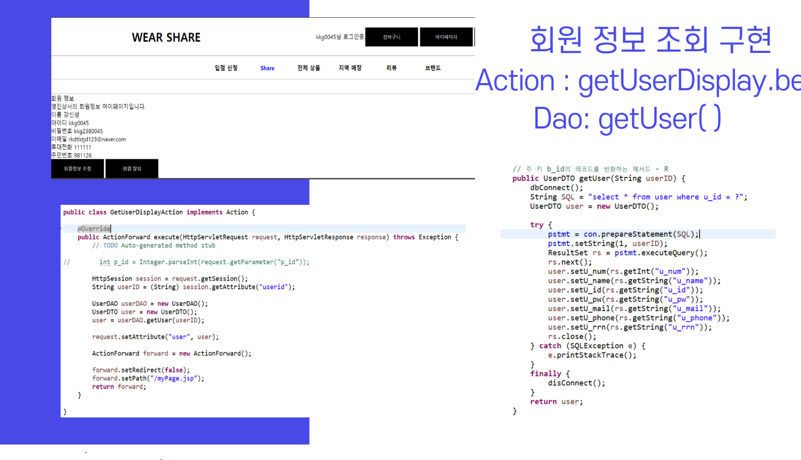<br>
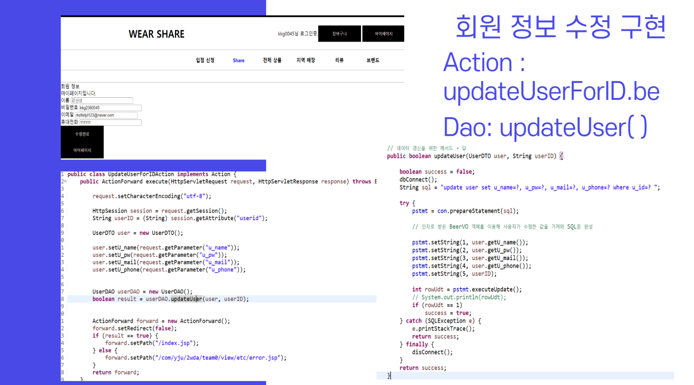<br>
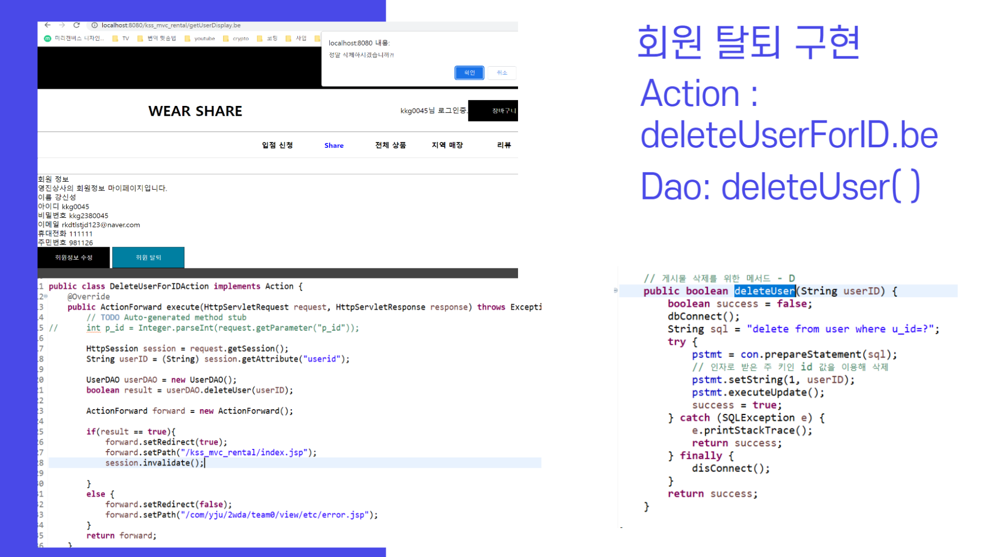<br>
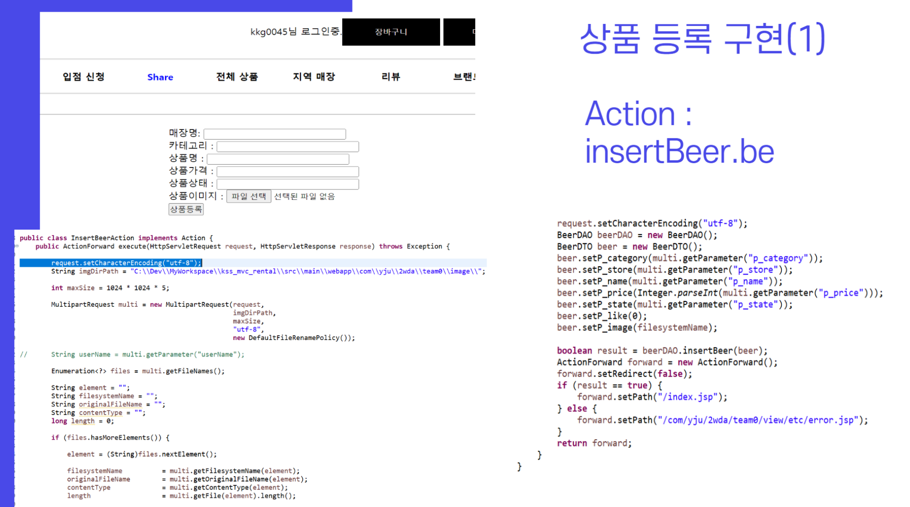<br>
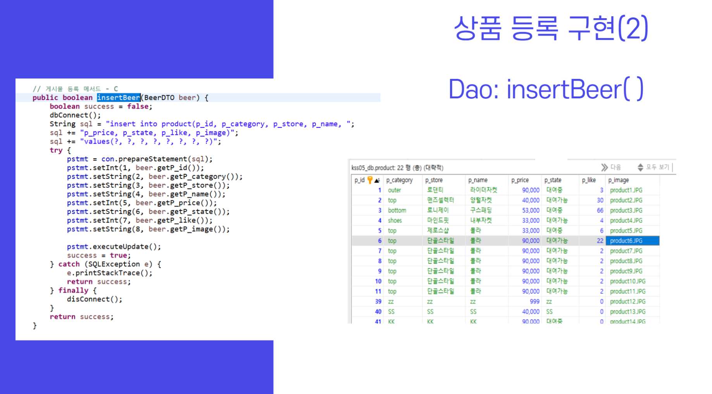<br>
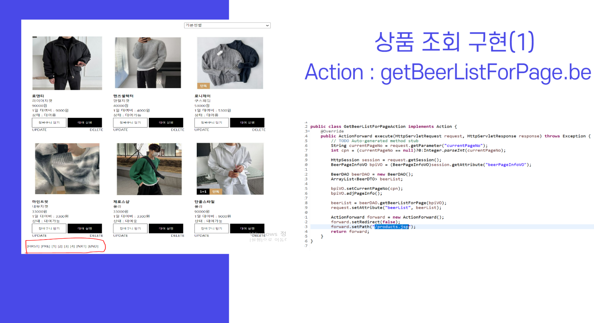<br>
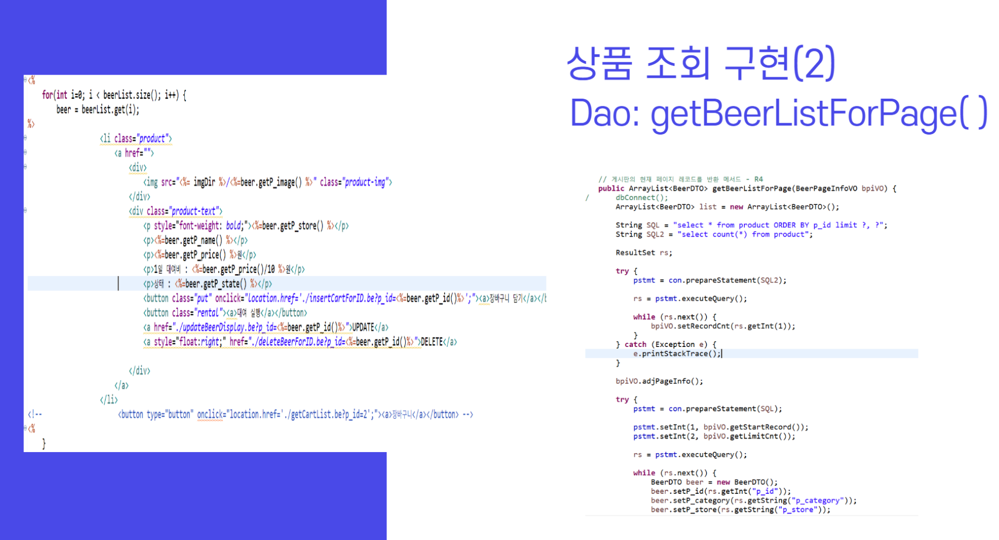<br>
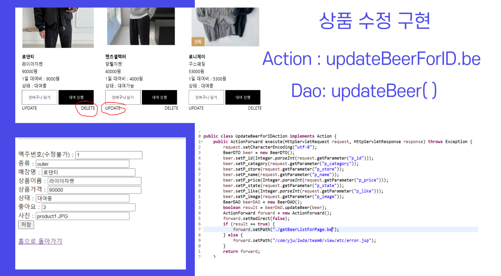<br>
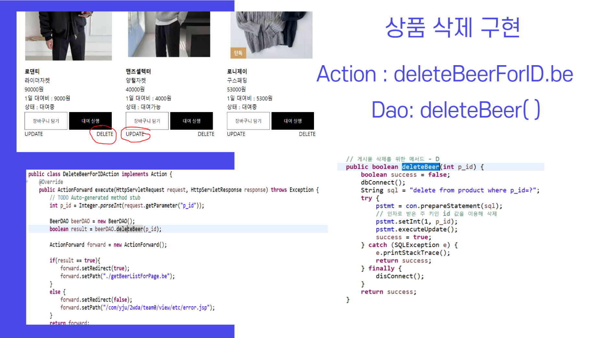<br>
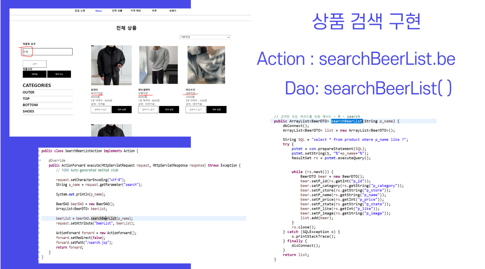<br>
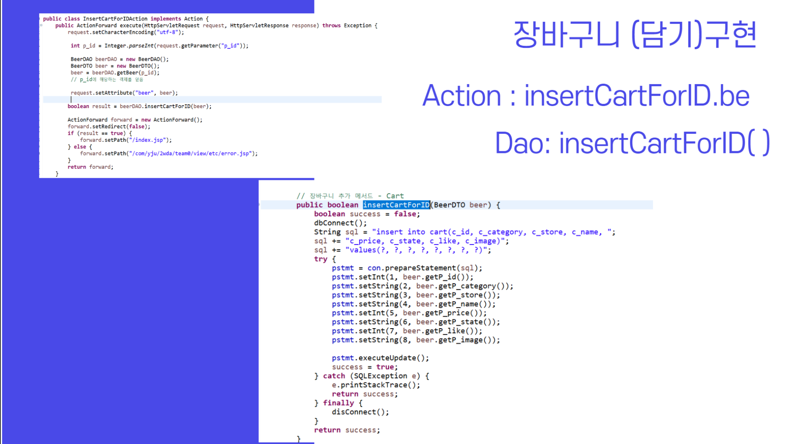<br>
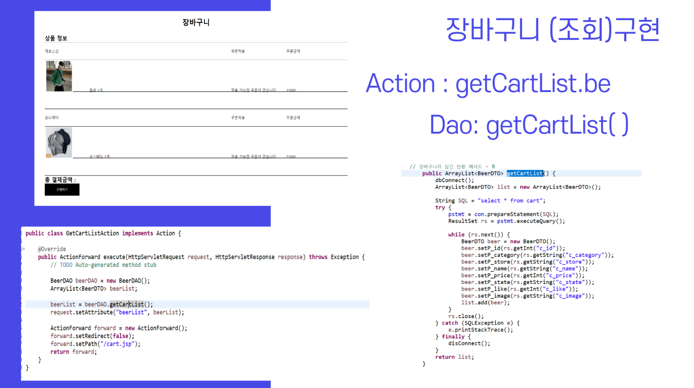<br>


